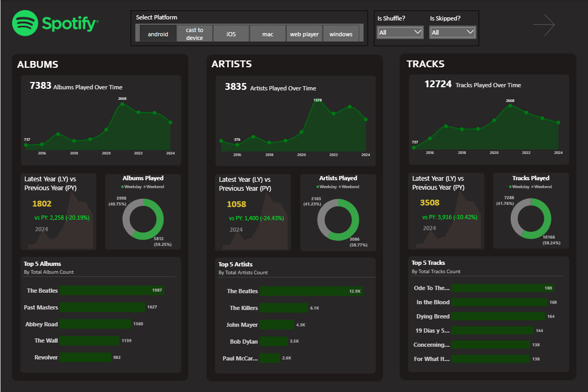
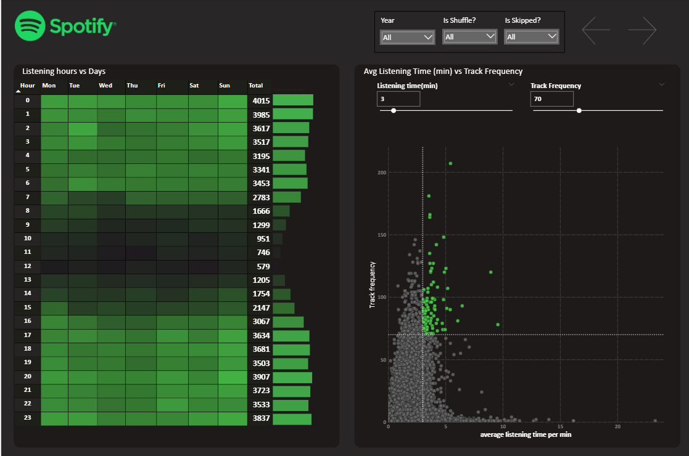
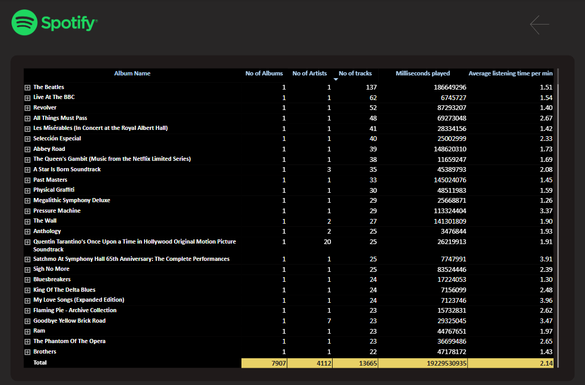

# 🎧 Spotify Listening Behavior Analysis

Analyze Spotify streaming data to understand user listening patterns, playback behaviors, and content engagement across tracks, artists, and platforms.

---

## 📑 Dataset Description

The dataset includes streaming sessions with fields capturing user behavior, platform, and track metadata.

| Column Name         | Description                                                                 |
|---------------------|-----------------------------------------------------------------------------|
| `spotify_track_uri` | Unique Spotify track ID (`spotify:track:<base62>`)                          |
| `ts`                | UTC timestamp when the track stopped (ISO 8601 format)                      |
| `platform`          | Device used: `desktop`, `mobile`, `web`, `smart_speaker`                   |
| `ms_played`         | Milliseconds played before stopping/skipping                               |
| `track_name`        | Name of the track                                                           |
| `artist_name`       | Artist performing the track                                                 |
| `album_name`        | Album to which the track belongs                                            |
| `reason_start`      | Why the track started: `trackdone`, `clickrow`, `autoplay`, etc.           |
| `reason_end`        | Why the track stopped: `trackdone`, `fwdbtn`, `logout`, etc.               |
| `shuffle`           | Was shuffle mode ON? (`TRUE` / `FALSE`)                                    |
| `skipped`           | Was the track skipped? (`TRUE` / `FALSE`)                                  |

---

## 🎯 Goals of the Analysis

- Track popular songs, artists, and albums
- Understand user behavior and skip rates
- Identify playback patterns by platform
- Analyze listening duration (`ms_played`)
- Detect shuffle usage trends
- Examine reasons for track start and stop

---
## 📊 Dashboards Overview

  
  
  

---

## 🧠 Example Insights

- Are users skipping more on mobile than desktop?
- Do most plays come from autoplay or manual selection?
- Which artists keep users engaged the longest?
- Is shuffle mode linked to higher skip rates?

---

## 🛠️ Tools Used

- **Power BI** – Data modeling, DAX, dashboards
- **Git & GitHub** – Version control and collaboration

---

 ## 📁 Folder Structure 

 Spotify-Listening-Behavior-Analysis/
│
├── images/ # Screenshots of dashboards used in README
├── DataSet/ # Spotify listening dataset (CSV or Excel)
├── spotify.pbix # Power BI project file
└── README.md # Project documentation

